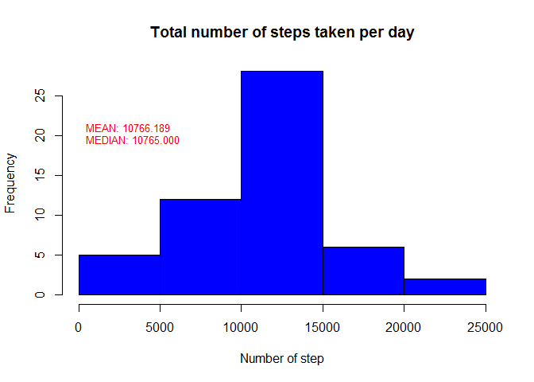
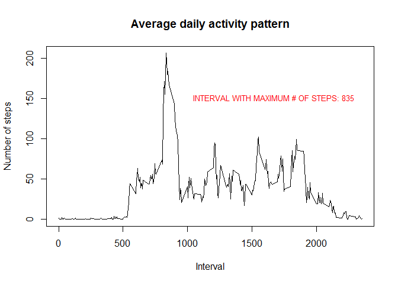
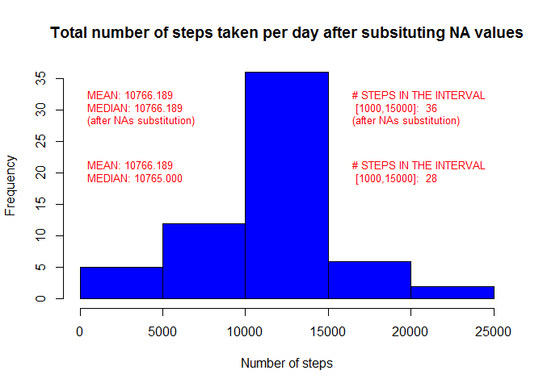
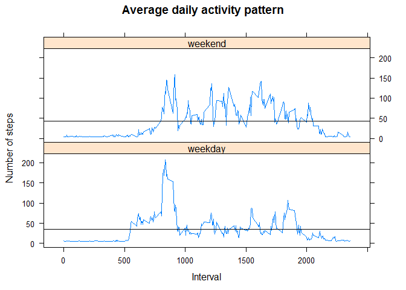

# Reproducible Research: Peer Assessment 1

## Loading and preprocessing the data

```r
suppressMessages(library(lubridate))
suppressMessages(library(lattice))
```

```r
zipFilename <- "activity.zip"
filename <- "activity.csv"

##decompress the zip file
if (!file.exists(filename)){ 
        unzip(zipFilename) 
}

activity <- read.csv("activity.csv")
#convert date columne into Date
activity$date <- ymd(activity$date)
head(activity)
```

```
##   steps       date interval
## 1    NA 2012-10-01        0
## 2    NA 2012-10-01        5
## 3    NA 2012-10-01       10
## 4    NA 2012-10-01       15
## 5    NA 2012-10-01       20
## 6    NA 2012-10-01       25
```


## What is mean total number of steps taken per day?


```r
stepsPerDay <- tapply(activity$steps,activity$date,sum)
```

```r
hist(stepsPerDay,
     main = "Total number of steps taken per day",
     xlab = "Number of step",
     col = "blue")

m <- mean(stepsPerDay,na.rm = TRUE)
med <- median(stepsPerDay,na.rm = TRUE)

text(0,
     20,
     sprintf("MEAN: %3.3f\nMEDIAN: %3.3f", m, med),
     col = "red",
     cex = .8, #expansion factor
     pos = 4)  #left justified
```

<!-- -->

## What is the average daily activity pattern?

```r
average.dayly <- tapply(activity$steps,
                        activity$interval,
                        mean,na.rm = TRUE)
```

```r
plot(   names(average.dayly),
        average.dayly,
        main = "Average daily activity pattern",
        xlab = "Interval",
        ylab = "Number of steps",
        type="l"
)

index <- which(average.dayly == max(as.numeric(average.dayly)))
interval <- names(average.dayly)[index]
text(1000,
     150,
     sprintf("INTERVAL WITH MAXIMUM # OF STEPS: %s",interval),
     col = "red",
     cex = .8, #expansion factor
     pos = 4)  #left justified
```

<!-- -->

## Imputing missing values

```r
# na.count <- sum(is.na(activity$steps))
na.count <- sum(is.na(activity$steps))
na.percentage <- na.count/nrow(activity)
```
Total number of missing value in the dataset

```
## [1] 2304
```
Percentage of missing value in the dataset

```
## [1] 0.1311475
```
it has been used the following strategy for substituting NA value in the steps column:

* NA <- daily-mean / # of intervals in the days

```r
activity.na.filled <- activity #make a copy of the dataset
na.indeces <- is.na(activity.na.filled$steps)
interval.number <- length(unique(activity.na.filled$interval))
activity.na.filled[na.indeces,"steps"] <- m/interval.number #subistituing

stepsPerDay.sub <- tapply(activity.na.filled$steps,
                      activity.na.filled$date,
                      sum)
```

```r
hist(stepsPerDay.sub,
     main = "Total number of steps taken per day after subsituting NA values",
     xlab = "Number of steps",
     col = "blue")

m.sub <- mean(stepsPerDay.sub,na.rm = TRUE)
med.sub <- median(stepsPerDay.sub,na.rm = TRUE)

steps.number.mean.interval <- sum(stepsPerDay < 15000 & stepsPerDay > 10000,na.rm = TRUE)
steps.number.mean.interval.sub <- sum(stepsPerDay.sub < 15000 & stepsPerDay.sub > 10000)


text(0,
     20,
     sprintf("MEAN: %3.3f\nMEDIAN: %3.3f", m, med),
     col = "red",
     cex = .8, #expansion factor
     pos = 4)  #left justified
text(0,
     30,
     sprintf("MEAN: %3.3f\nMEDIAN: %3.3f \n(after NAs substitution)", m.sub, med.sub),
     col = "red",
     cex = .8, #expansion factor
     pos = 4)  #left justified

text(16000,
     20,
     sprintf("# STEPS IN THE INTERVAL\n [1000,15000]: %3.0f", steps.number.mean.interval),
     col = "red",
     cex = .8, #expansion factor
     pos = 4)  #left justified
text(16000,
     30,
     sprintf("# STEPS IN THE INTERVAL\n [1000,15000]: %3.0f \n(after NAs substitution)", steps.number.mean.interval.sub),
     col = "red",
     cex = .8, #expansion factor
     pos = 4)  #left justified
```

<!-- -->

Do mean and meadian differ from the estimates from the first part of the assignment? 

* YES, the new median has become like the mean (calculate without subsituting).

What is the impact of imputing missing data on the estimates of the total daily number of steps?

* An increment of the number of steps of ``8`` in the interval [10000,15000]

## Are there differences in activity patterns between weekdays and weekends?

```r
activity.na.filled$day.type <- factor((weekdays(activity$date) %in% c("sabato","domenica")),labels = c("weekday","weekend")) #creation of the factor variable (Sabato, domenica = saturday, sunday)

average.dayly.daytype <- aggregate(steps ~ day.type + interval, data = activity.na.filled, mean)
```

```r
xyplot(steps ~ interval | day.type,
       data = average.dayly.daytype,
       main = "Average daily activity pattern",
       xlab = "Interval",
       ylab = "Number of steps",
       type='l',
       layout=c(1,2),
       panel = function(x,y,...){
               panel.xyplot(x,y,...)
               panel.abline(h = mean(y), ...)
       })
```

<!-- -->
